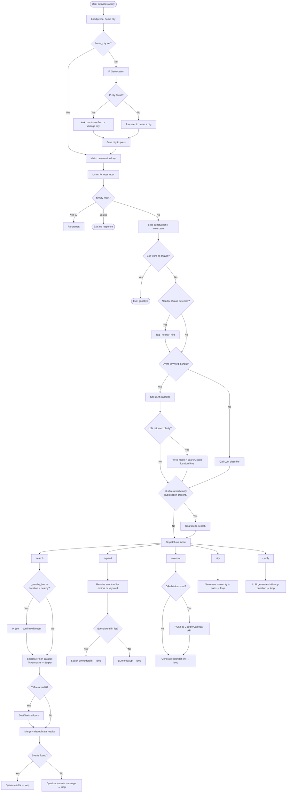

# Local Event Explorer

The **Local Event Explorer** is an OpenHome community ability that helps users discover concerts, sports, comedy, and festivals in their area. It uses **Ticketmaster** and **Serper.dev** (Google Events) in parallel as primary sources, falling back to **SeatGeek** if both return nothing.

## Features

- **Smart Geolocation**: Detects your city via IP on first run and asks you to confirm. Saves your home city persistently. Saying "nearby" at any time re-triggers IP detection.
- **Natural Language Time Parsing**: Ask for events "tonight", "this weekend", "next Saturday", or any other time phrase — parsed by LLM into exact date ranges.
- **Robust Intent Classification**: Keyword-first pre-classification catches event genres (jazz, comedy, concert…) and polite exits (thanks, bye, no thanks…) before the LLM, with punctuation-tolerant word matching for STT output.
- **Parallel API Fetching**: Ticketmaster and Serper run simultaneously via `asyncio.gather`; SeatGeek runs only as a fallback.
- **Interactive Drill-Down**: Ask for details on a specific result by position ("the first one") or keyword ("the jazz show").
- **Add to Calendar**: Directly inserts into Google Calendar if OAuth tokens are configured, otherwise generates a pre-filled Google Calendar link.
- **STT Bleed Protection**: Captures and validates the trigger text so accidental wake-word transcriptions don't pollute the first search.

## Flow Diagram



## Setup Instructions

To use this ability you need to provide API keys. You can hardcode them into the `AppConfig` class in `main.py`, or store them in the preferences file `event_explorer_prefs.json`:

```json
{
  "home_city": "Paris",
  "api_key_ticketmaster": "YOUR_KEY_HERE",
  "api_key_seatgeek": "YOUR_KEY_HERE",
  "api_key_serper": "YOUR_KEY_HERE"
}
```

### 1. Get API Keys

1. **Ticketmaster** (Primary): [Ticketmaster Developer Portal](https://developer.ticketmaster.com/) — free account gives you an API key.
2. **Serper.dev** (Google Events): [Serper.dev](https://serper.dev/) — 2,500 free queries on signup.
3. **SeatGeek** (Fallback): [SeatGeek Platform](https://seatgeek.com/account/develop) — register an app for a Client ID.
4. **Google Calendar** (Optional): Create an OAuth 2.0 Client ID in Google Cloud Console. Exchange an authorization code for a `refresh_token` and `access_token` via the `oauth2.googleapis.com` token endpoint, then add them to `AppConfig`.

### 2. Google Calendar OAuth (optional)

If Google tokens are left empty, the ability falls back to generating a pre-filled Google Calendar link and speaking the event name. No calendar insertion will happen automatically.

To enable direct insertion, add these to `AppConfig` in `main.py`:

```python
GOOGLE_CLIENT_ID     = "..."
GOOGLE_CLIENT_SECRET = "..."
GOOGLE_ACCESS_TOKEN  = "..."
GOOGLE_REFRESH_TOKEN = "..."
```

## Example Prompts

- "Open Event Explorer."
- "Nearby comedy events."
- "Find jazz shows this weekend in Cairo."
- "Are there any concerts tonight?"
- "Search for Taylor Swift in New Orleans."
- "Tell me more about the second one."
- "Add that to my calendar."
- "My city is Berlin."
- "No thanks." / "Done." / "Goodbye."
