# 📈 Market Pulse — Real-Time Currency & Gold Price Tracker


A voice-first OpenHome Ability that delivers live exchange rates, gold, and silver prices through natural conversation. Uses a **3-tier data strategy**: [Alpha Vantage](https://www.alphavantage.co/) → [Frankfurter](https://frankfurter.app/) → LLM fallback.

---

## ✨ What It Does

| Capability | Example Query | Response |
|---|---|---|
| **Gold price (USD)** | "What's the gold price?" | "Gold is at 5034.04 dollars per ounce." |
| **Silver price (USD)** | "How much is silver?" | "Silver is at 31.25 dollars per ounce." |
| **Gold/Silver in any currency** | "Gold price in euro" | "Gold is at 4239.75 EUR per ounce." |
| **Currency exchange rates** | "Dollar to yen" | "1 USD equals 149.52 JPY." |

> *The ability uses the LLM to classify intent from messy voice transcription, so users don't need to say exact phrases.*

---

## 🏗️ Architecture

```mermaid
graph TD
    A["🎤 User speaks trigger word"] --> B["Main Flow detects hotword"]
    B --> C["MarketPulseAbility.call()"]
    C --> D{"Read trigger context"}
    D -->|"Clear intent"| E["⚡ Quick Mode"]
    D -->|"Vague / no intent"| F["💬 Full Mode"]

    E --> G["classify_intent() via LLM"]
    G --> H["handle_query()"]
    H --> I{"Intent type?"}

    I -->|"gold_price"| J["🥇 Alpha Vantage → LLM fallback"]
    I -->|"silver_price"| K["🥈 Alpha Vantage → LLM fallback"]
    I -->|"spot_in_currency"| L["🥇 Spot API + LLM conversion"]
    I -->|"exchange_rate"| M["💱 Alpha Vantage → Frankfurter → LLM"]
    I -->|"unknown"| N["❓ Ask user to clarify"]

    J --> O["speak() result"]
    K --> O
    L --> O
    M --> O

    F --> P["Greet user"]
    P --> Q["🔄 Multi-turn loop"]
    Q --> G

    O -->|"Quick Mode"| R["Offer 1 follow-up → exit"]
    O -->|"Full Mode"| S["Ask 'Anything else?' → loop"]

    R --> T["resume_normal_flow()"]
    S -->|"Exit word or 2x idle"| T
```



---

## 🔄 Conversation Flow

```mermaid
sequenceDiagram
    participant U as 🎤 User
    participant MP as MarketPulse
    participant LLM as LLM Router
    participant AV as Alpha Vantage
    participant FK as Frankfurter

    U->>MP: "Market" (trigger word)
    MP->>MP: Read trigger context
    
    alt Quick Mode (clear intent in trigger)
        MP->>LLM: classify_intent("what's gold price?")
        LLM-->>MP: {"intent": "gold_price"}
        MP->>U: "One sec, checking gold prices."
        MP->>AV: GOLD_SILVER_SPOT?symbol=GOLD
        alt API works
            AV-->>MP: {"price": "5034.04"}
            MP->>U: "Gold is at 5034.04 dollars per ounce."
        else API blocked (shared IP limit)
            AV-->>MP: {"Information": "rate limit..."}
            MP->>LLM: "What is the approximate gold price?"
            LLM-->>MP: "Gold is approximately 5040 dollars per ounce."
            MP->>U: "Gold is approximately 5040 dollars per ounce."
        end
        MP->>U: "Need anything else on prices?"
    else Full Mode (vague trigger)
        MP->>U: "Market Pulse here. Ask me about exchange rates or gold prices."
        loop Multi-turn conversation
            U->>MP: "Dollar to euro"
            MP->>LLM: classify_intent("dollar to euro")
            LLM-->>MP: {"intent": "exchange_rate"}
            MP->>AV: CURRENCY_EXCHANGE_RATE
            alt API works
                AV-->>MP: {"rate": "0.84"}
            else API blocked
                MP->>FK: Frankfurter /latest?from=USD&to=EUR
                FK-->>MP: {"rates": {"EUR": 0.84}}
            end
            MP->>U: "1 USD equals 0.84 EUR."
            MP->>U: "Anything else?"
        end
    end
    
    MP->>MP: resume_normal_flow()
```



---

## 📁 File Structure

```
marketplus/
├── main.py          # Ability logic (MarketPulseAbility class)
└── README.md        # This file
```

---

## 🚀 Try It Yourself

Want to run this ability on your own OpenHome personality? Follow these steps:

### 1. Register & Create an Ability

1. Sign up at [**app.openhome.com**](https://app.openhome.com)
2. Go to **My Abilities** → **Create New Ability**
3. Name it anything you like (e.g., "Market Pulse")

### 2. Copy the Code

This repo only contains two files you need:
- **`main.py`** — copy the full contents into your ability's `main.py`
- **`README.md`** — this file (for reference)

### 3. Set Your API Key

Get a free key at [alphavantage.co/support](https://www.alphavantage.co/support/#api-key), then replace line 14 in `main.py`:

```python
API_KEY = "YOUR_API_KEY_HERE"
```

> **Note:** The free tier is 25 calls/day, and the OpenHome server shares an IP — so the Alpha Vantage quota may be exhausted by other users. The ability automatically falls back to **Frankfurter** (for currencies) or the **LLM** (for metals) when this happens.

### 4. Set Trigger Words

In your ability's settings, add these hotwords:

```
market, market plus, marketplus
```

---

## 📄 License

Part of the OpenHome Community Abilities collection.
