# 📈 Market Pulse — Real-Time Currency & Gold Price Tracker


A voice-first OpenHome Ability that delivers live exchange rates, gold, and silver prices through natural conversation. Powered by the [Alpha Vantage](https://www.alphavantage.co/) API.

---

## ✨ What It Does

| Capability | Example Query | Response |
|---|---|---|
| **Gold price (USD)** | "What's the gold price?" | "Gold is at 5034.04 dollars per ounce." |
| **Silver price (USD)** | "How much is silver?" | "Silver is at 31.25 dollars per ounce." |
| **Gold/Silver in any currency** | "Gold price in euro" | "Gold is at 4239.75 EUR per ounce." |
| **Currency exchange rates** | "Dollar to yen" | "1 USD equals 149.52 JPY." |

> *The ability uses the LLM to classify intent from messy voice transcription, so users don't need to say exact phrases.*

---

## 🏗️ Architecture

```mermaid
graph TD
    A["🎤 User speaks trigger word"] --> B["Main Flow detects hotword"]
    B --> C["MarketPulseAbility.call()"]
    C --> D{"Read trigger context"}
    D -->|"Clear intent"| E["⚡ Quick Mode"]
    D -->|"Vague / no intent"| F["💬 Full Mode"]

    E --> G["classify_intent() via LLM"]
    G --> H["handle_query()"]
    H --> I{"Intent type?"}

    I -->|"gold_price"| J["🥇 GOLD_SILVER_SPOT API"]
    I -->|"silver_price"| K["🥈 GOLD_SILVER_SPOT API"]
    I -->|"spot_in_currency"| L["🥇 Spot API + LLM conversion"]
    I -->|"exchange_rate"| M["💱 CURRENCY_EXCHANGE_RATE API"]
    I -->|"unknown"| N["🥇 Default: gold in USD"]

    J --> O["speak() result"]
    K --> O
    L --> O
    M --> O
    N --> O

    F --> P["Greet user"]
    P --> Q["🔄 Multi-turn loop"]
    Q --> G

    O -->|"Quick Mode"| R["Offer 1 follow-up → exit"]
    O -->|"Full Mode"| S["Ask 'Anything else?' → loop"]

    R --> T["resume_normal_flow()"]
    S -->|"Exit word or 2x idle"| T
```



---

## 🔄 Conversation Flow


---

## 📁 File Structure

```
marketplus/
├── main.py          # Ability logic (MarketPulseAbility class)
├── config.json      # Trigger words and unique name
├── __init__.py      # Empty (required for Python package)
└── README.md        # This file
```

---

## 🚀 Try It Yourself

Want to run this ability on your own OpenHome personality? Follow these steps:

### 1. Register & Create an Ability

1. Sign up at [**app.openhome.com**](https://app.openhome.com)
2. Go to **My Abilities** → **Create New Ability**
3. Name it anything you like (e.g., "Market Pulse")

### 2. Copy the Code

This repo only contains two files you need:
- **`main.py`** — copy the full contents into your ability's `main.py`
- **`README.md`** — this file (for reference)

### 3. Set Your API Key

Get a free key at [alphavantage.co/support](https://www.alphavantage.co/support/#api-key), then replace line 17 in `main.py`:

```python
API_KEY = "YOUR_API_KEY_HERE"
```

> **Free tier:** 25 API calls/day. Each query uses 1 call. Gold-in-EUR uses 1 call + LLM conversion (free).

### 4. Set Trigger Words

In your ability's settings, add these hotwords:

```
market, market plus, marketplus
```

---

## 🧠 How It Works

### LLM Intent Router

Instead of fragile keyword matching, the ability sends user input to the LLM for classification. The prompt explicitly handles messy voice transcription (e.g., `"goal"` → gold, `"process"` → price):


### Supported Intents

| Intent | Description | API Used |
|---|---|---|
| `gold_price` | Gold price in USD | `GOLD_SILVER_SPOT` (1 call) |
| `silver_price` | Silver price in USD | `GOLD_SILVER_SPOT` (1 call) |
| `spot_in_currency` | Gold/silver in non-USD currency | `GOLD_SILVER_SPOT` + LLM (1 call) |
| `exchange_rate` | Fiat currency pair rate | `CURRENCY_EXCHANGE_RATE` (1 call) |
| `unknown` | Fallback → gold in USD | `GOLD_SILVER_SPOT` (1 call) |

### Quick Mode vs Full Mode

```mermaid
graph TD
    A{"Trigger context has clear intent?"} -->|Yes| B["⚡ Quick Mode"]
    A -->|No| C["💬 Full Mode"]
    
    B --> D["Answer immediately"]
    D --> E["'Need anything else?'"]
    E -->|Yes| F["Handle 1 follow-up"]
    E -->|No/silence| G["Exit silently"]
    
    C --> H["Greet user"]
    H --> I["🔄 Multi-turn loop"]
    I --> J["Handle query"]
    J --> K["'Anything else?'"]
    K -->|User asks more| I
    K -->|Exit word| L["'Got it, signing off.'"]
    K -->|2x idle| M["'I'll sign off.'"]
```



### Error Handling & Retry

When the API fails, the ability doesn't just move on — it asks the user:

```
"I couldn't get that info. Want me to try again?"
```

If the user says "yes", it retries automatically.

Three error types are handled:

| Alpha Vantage Response | What the User Hears |
|---|---|
| `{"Note": "..."}` | "Rate limit hit. Try again in a minute." |
| `{"Information": "..."}` | "Daily API limit reached. Try again tomorrow." |
| `{"Error Message": "..."}` | "Something went wrong with the API." |

---

## 🔧 Technical Details

| Property | Value |
|---|---|
| **SDK** | OpenHome Ability SDK (`MatchingCapability`) |
| **API** | Alpha Vantage (free tier: 25 calls/day) |
| **Timeouts** | 10 seconds on all `requests.get()` |
| **Async** | `asyncio.to_thread()` for blocking API calls |
| **LLM Calls** | `text_to_text_response()` (synchronous, no `await`) |
| **Exit Safety** | `try/finally` ensures `resume_normal_flow()` always fires |
| **Logging** | `editor_logging_handler` (no `print()`) |

---

## 🐛 Troubleshooting

### "Daily API limit reached"
The free Alpha Vantage key allows only **25 requests per day**. Options:
- Wait until tomorrow
- Upgrade to a [premium key](https://www.alphavantage.co/premium/)

### "Critical Import Error" after upload
This means the server cached a broken version. Fix:
1. **Delete** the old ability from the dashboard
2. **Create a new ability** with a different name
3. Re-upload the `marketplus/` folder

### Ability not triggering
- Verify trigger words in **Installed Abilities** on the dashboard
- Make sure `config.json` has the correct `matching_hotwords`
- Ensure the ability is **active** (not paused)

### LLM misclassifies intent
Voice transcription is messy. If a query keeps being misclassified:
- Speak more clearly and pause between words
- Use explicit phrases like "gold price" or "dollar to euro"
- The fallback always defaults to gold price in USD

---

## 📋 Best Practices Checklist

This ability follows all patterns from the [Building Great OpenHome Abilities](https://openhome.xyz) guide:

- [x] `resume_normal_flow()` on every exit path (`try/finally`)
- [x] No `print()` — uses `editor_logging_handler`
- [x] `asyncio.to_thread()` for blocking `requests` calls
- [x] All API calls have `timeout=10`
- [x] Exit word detection in the multi-turn loop
- [x] Filler speech before slow API calls
- [x] `text_to_text_response()` without `await`
- [x] Retry prompt on API failure
- [x] Short, voice-friendly `speak()` strings (1–2 sentences)
- [x] LLM intent router instead of keyword matching
- [x] Trigger context reading for Quick Mode

---

## 📄 License

Part of the OpenHome Community Abilities collection.
