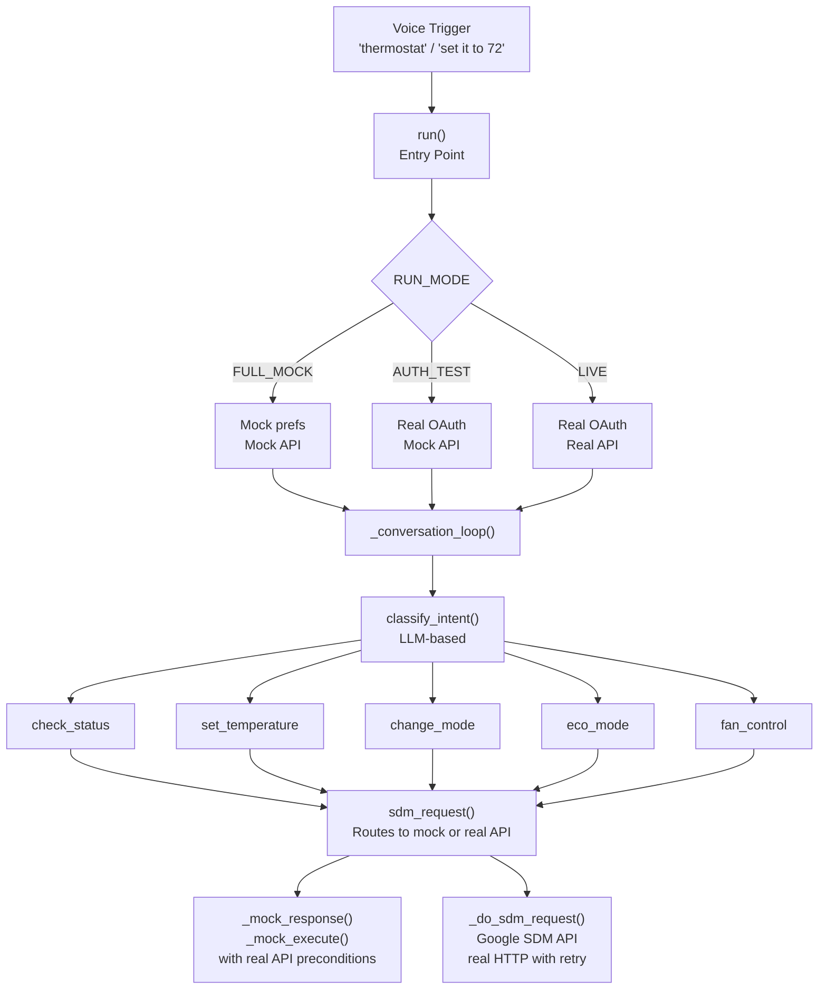
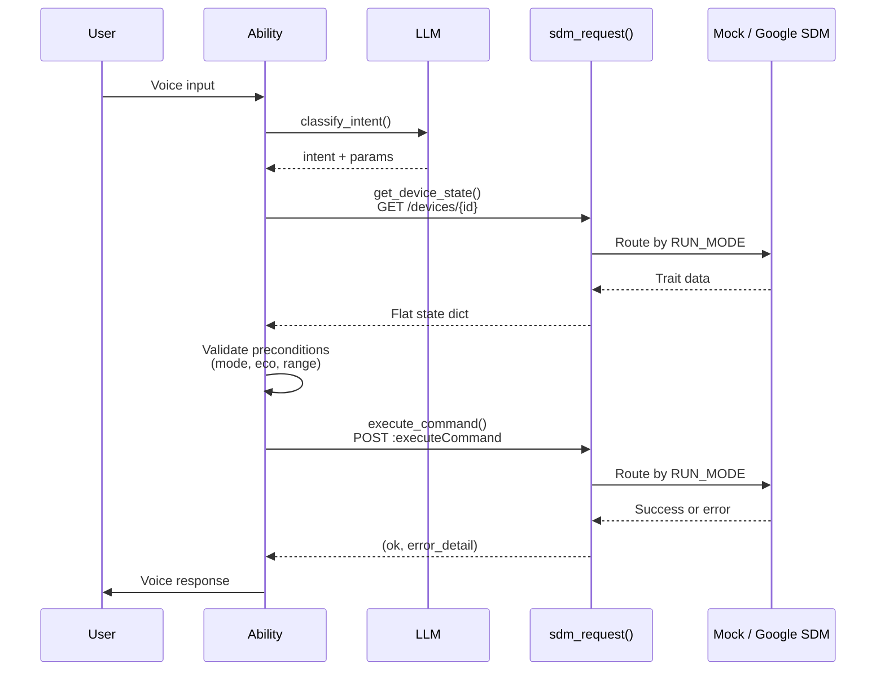

# Nest Thermostat


Voice control your Google Nest Thermostat through OpenHome. Check the temperature, set targets, change modes, toggle eco mode, and control the fan — all by voice.

---

## What It Does

| Voice Command | What Happens |
|---|---|
| "What's the temperature?" | Reads current temp, humidity, mode, and HVAC status |
| "Set it to 72" | Sets the target temperature |
| "Turn it up" / "Turn it down" | Adjusts setpoint by 2 degrees |
| "Switch to heat" / "Turn on the AC" | Changes thermostat mode |
| "Turn on eco mode" | Enables energy-saving eco mode |
| "Turn off eco mode" | Restores previous mode |
| "Turn on the fan" | Runs fan for 15 minutes (default) |
| "Run the fan for an hour" | Runs fan with timer |
| "Turn off the fan" | Stops fan |

---

## Architecture



### Data Flow



---

## Supported Devices

- Nest Thermostat (2020)
- Nest Thermostat E
- Nest Learning Thermostat (all generations)

**Not supported:** Nest Protect, Nest Secure, Nest Temperature Sensors, legacy Nest accounts, Google Workspace accounts.

---

## Setup

This ability uses the [Google Smart Device Management (SDM) API](https://developers.google.com/nest/device-access). Setup requires a **one-time $5 fee** to Google for Device Access registration.

### Prerequisites

1. A Google account with a Nest thermostat set up in the Google Home app
2. A consumer Gmail account (Google Workspace accounts are not supported)

### Step 1 — Register for Device Access ($5)

Go to [console.nest.google.com/device-access](https://console.nest.google.com/device-access), accept the Terms of Service, and pay the one-time fee. This is a Google requirement — not refundable.

### Step 2 — Create a Google Cloud Project

1. Go to [console.cloud.google.com](https://console.cloud.google.com)
2. Create a new project (or use an existing one)
3. Enable the **Smart Device Management API** under APIs & Services → Library

### Step 3 — Create OAuth 2.0 Credentials

1. Go to APIs & Services → Credentials → Create Credentials → OAuth client ID
2. Application type: **Web application**
3. Add `https://www.google.com` as an Authorized Redirect URI
4. Copy your **Client ID** and **Client Secret**

### Step 4 — Set OAuth Consent Screen to Production

Go to APIs & Services → OAuth consent screen → set Publishing Status to **Production**. This prevents your login token from expiring after 7 days. No Google review is required for personal use.

### Step 5 — Create a Device Access Project

1. Go back to [console.nest.google.com/device-access](https://console.nest.google.com/device-access)
2. Create a new project, enter your OAuth Client ID
3. Skip Pub/Sub events
4. Copy your **Device Access Project ID** (a UUID)

### Step 6 — Activate in OpenHome

Say "thermostat" or "what's the temperature" — the ability will walk you through connecting your account, authorizing access, and discovering your thermostat automatically. The consent URL will appear in your logs for easy copying.

---

## Trigger Words

```
nest, thermostat, temperature, how warm, how cold,
set it to, set the temperature, turn up, turn down,
switch to heat, switch to cool, turn on the heat,
turn on the AC, turn off the thermostat, eco mode,
turn on eco, turn off eco, turn on the fan, fan on,
fan off, is the heat on, is the AC on
```

---

## Credentials Stored

This ability stores credentials in `nest_thermostat_prefs.json` on your device:

- OAuth Client ID and Client Secret
- Access token and refresh token
- Device Access Project ID
- Thermostat device ID and configuration

Credentials are never transmitted to OpenHome servers — they stay on your device.

---

## Notes

- **All API temperatures are Celsius.** The ability converts to Fahrenheit automatically based on your thermostat's settings.
- **Eco mode blocks temperature changes.** If eco mode is on, you'll be asked to turn it off before setting a temperature.
- **Fan control** requires a thermostat model that supports it. The ability checks automatically.
- **Heat must be less than cool** in auto (HEATCOOL) mode. The ability validates this before sending commands.
- **Multiple thermostats:** V1 controls your first thermostat. Multi-thermostat support is planned for V2.

---

## Development (Run Modes)

Set `RUN_MODE` at the top of `main.py` to control how the ability connects:

| Mode | Constant | OAuth | Device API | Use Case |
|---|---|---|---|---|
| **Full Mock** | `MODE_FULL_MOCK` | Simulated | Simulated | Development without any credentials or hardware |
| **Auth Test** | `MODE_AUTH_TEST` | Real | Simulated | Verify OAuth credentials work (requires a Nest device on the account) |
| **Live** | `MODE_LIVE` | Real | Real | Production use with a physical Nest thermostat |

### Mock Fidelity

The mock enforces the same preconditions as the real Google SDM API:

- `SetHeat` only works in HEAT mode, `SetCool` in COOL, `SetRange` in HEATCOOL
- All setpoint commands rejected during MANUAL_ECO mode
- Eco mode change rejected when thermostat mode is OFF
- `SetRange` validates that heat < cool
- Fan commands rejected if the device has no fan
- GET responses only return setpoints for the current mode (HEAT returns only `heatCelsius`, etc.)
- Mock state is mutable — changes persist across reads within a session

### Quick Start (Development)

```python
# main.py line 22
RUN_MODE = MODE_FULL_MOCK  # default — no setup needed
```

Trigger the ability and try the test scenarios below.

### Test Scenarios

Run these in `FULL_MOCK` mode to verify all voice flows and edge cases.

#### Scenario 1: Check Status

| Step | You Say | Expected Response |
|------|---------|-------------------|
| 1 | "What's the temperature?" | "It's currently 71 degrees inside. The thermostat is set to heat at 72 degrees. The heater is running." |

#### Scenario 2: Set Temperature (Happy Path)

| Step | You Say | Expected Response |
|------|---------|-------------------|
| 1 | "Set it to 75" | "Done. I've set the thermostat to 75 degrees." |
| 2 | "What's the temperature?" | Should reflect new setpoint of 75 |

#### Scenario 3: Set Temperature When Thermostat is OFF

| Step | You Say | Expected Response |
|------|---------|-------------------|
| 1 | "Turn off the thermostat" | "Done. The thermostat is now set to off mode." |
| 2 | "Set it to 72" | "The thermostat is off, so I can't set a temperature. Want me to switch it to heat or cool first?" |
| 3 | "Yes" | Switches to heat mode, then sets temperature |

#### Scenario 4: Set Temperature During Eco Mode

| Step | You Say | Expected Response |
|------|---------|-------------------|
| 1 | "Turn on eco mode" | "Eco mode is now on..." |
| 2 | "Set it to 70" | "Eco mode is on, so I can't change the temperature. Should I turn off eco mode first?" |
| 3 | "Yes" | Turns off eco mode, then sets temperature |

#### Scenario 5: Relative Temperature Adjustment

| Step | You Say | Expected Response |
|------|---------|-------------------|
| 1 | "Turn it up" | "Done. I've set the thermostat to [current + 2] degrees." |
| 2 | "Turn it down" | "Done. I've set the thermostat to [current - 2] degrees." |

#### Scenario 6: Mode Changes

| Step | You Say | Expected Response |
|------|---------|-------------------|
| 1 | "Switch to cool" | "Done. The thermostat is now set to cool mode." |
| 2 | "Switch to heat" | "Done. The thermostat is now set to heat mode." |
| 3 | "Set it to auto" | "Done. The thermostat is now set to heat and cool mode." |
| 4 | "Turn off the thermostat" | "Done. The thermostat is now set to off mode." |

#### Scenario 7: Eco Mode Toggle

| Step | You Say | Expected Response |
|------|---------|-------------------|
| 1 | "Turn on eco mode" | "Eco mode is now on. The thermostat will use energy-saving temperatures. I won't be able to change the temperature until eco mode is turned off." |
| 2 | "Turn off eco mode" | "Eco mode is off. The thermostat is back to heat mode." |

#### Scenario 8: Eco Mode When Thermostat is OFF

| Step | You Say | Expected Response |
|------|---------|-------------------|
| 1 | "Turn off the thermostat" | "Done. The thermostat is now set to off mode." |
| 2 | "Turn on eco mode" | "I wasn't able to enable eco mode. This sometimes happens when the thermostat is off. Want me to switch it to heat mode first?" |
| 3 | "Yes" | Switches to heat, then enables eco mode |

#### Scenario 9: Fan Control

| Step | You Say | Expected Response |
|------|---------|-------------------|
| 1 | "Turn on the fan" | "The fan is running. It'll turn off automatically in 15 minutes." |
| 2 | "Run the fan for an hour" | "The fan is running. It'll turn off automatically in 1 hour." |
| 3 | "Turn off the fan" | "The fan is off." |

#### Scenario 10: HEATCOOL Range Validation

| Step | You Say | Expected Response |
|------|---------|-------------------|
| 1 | "Set it to auto" | "Done. The thermostat is now set to heat and cool mode." |
| 2 | "Set it to 72" | Should set one of the bounds (heat or cool) based on midpoint logic |
| 3 | Verify heat < cool | Check status should show valid heat/cool range |

#### Scenario 11: Out-of-Range Temperature

| Step | You Say | Expected Response |
|------|---------|-------------------|
| 1 | "Set it to 120" | "That temperature is out of range. Try something between 50 and 90 degrees." |

#### Scenario 12: Offline Device

> Note: Requires manually changing `MOCK_DEVICE_STATE["connectivity"]` to `"OFFLINE"` in `main.py`.

| Step | You Say | Expected Response |
|------|---------|-------------------|
| 1 | "What's the temperature?" | "Your thermostat appears to be offline. Check its WiFi connection." |

#### Scenario 13: Conversation Exit

| Step | You Say | Expected Response |
|------|---------|-------------------|
| 1 | "What's the temperature?" | Reads status |
| 2 | "Stop" / "Exit" / "Bye" | "Okay, let me know if you need anything else." |

---

## Author

Community contribution. See [CONTRIBUTING.md](../../CONTRIBUTING.md) for details.
